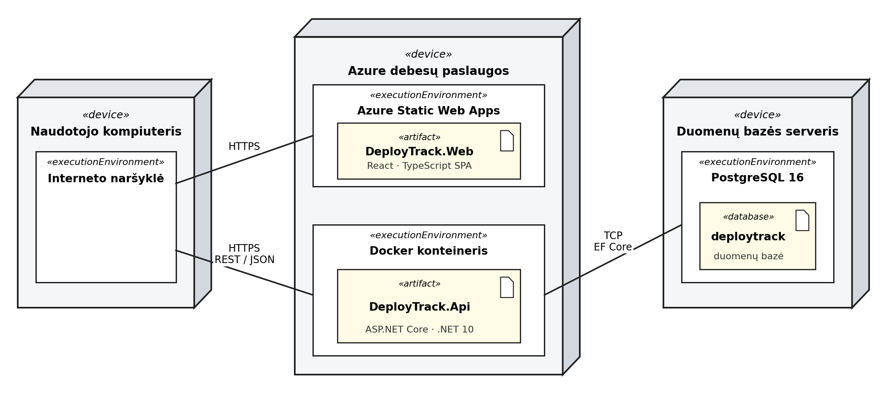

# DeployTrack

Diegimų sekimo sistema.

T120B165 Saityno taikomųjų programų projektavimas, KTU Informatikos fakultetas.
Viktoras Timofejevas, IFF-3/9.

## 1. Sprendžiamo uždavinio aprašymas

Kai komanda prižiūri kelis projektus ir kiekvieną jų diegia į kelias aplinkas (kūrimo,
testavimo, parengiamąją, produkcinę), pasidaro sunku atsakyti į paprastus klausimus:

* kuri versija šiuo metu veikia produkcinėje aplinkoje;
* kas ir kada ją ten įdiegė;
* ar tas diegimas su kuo nors buvo suderintas.

Atsakymai paprastai išsibarstę po CI sistemos žurnalus, pokalbių kanalus ir skaičiuokles.
Dėl to prieš kiekvieną išleidimą tenka klausinėti komandos narių. Taip pat niekas
netrukdo kūrėjui įdiegti į produkcinę aplinką be jokio patvirtinimo.

### 1.1. Sistemos paskirtis

DeployTrack skirta registruoti diegimus vienoje vietoje ir kontroliuoti, kas gali diegti į
apsaugotas aplinkas.

Sistemą sudaro dvi dalys: saityno paslauga (API), kurioje saugomi duomenys, ir internetinė
aplikacija, per kurią naudotojai su tais duomenimis dirba.

Veikimo eiga:

1. Administratorius sukuria projektą ir jo aplinkas. Aplinkai galima nurodyti, kad
   diegimui į ją reikia patvirtinimo.
2. Kūrėjas užregistruoja diegimą į pasirinktą aplinką.
3. Jei aplinkai patvirtinimo nereikia, diegimas iš karto laikomas patvirtintu. Jei reikia,
   diegimas lieka laukti.
4. Išleidimų vadovas laukiantį diegimą patvirtina arba atmeta.
5. Projekto apžvalgoje matyti, kuri versija šiuo metu veikia kiekvienoje aplinkoje.

### 1.2. Taikomosios srities objektai

Sistemoje yra trys taikomosios srities objektai. Jie susieti grandine, ryšiu vienas su
daug: vienas projektas turi daug aplinkų, o viena aplinka turi daug diegimų.

| Objektas | Ką reiškia | Laukai |
|----------|------------|--------|
| Projektas | Programinės įrangos projektas, kurio diegimai sekami | pavadinimas, aprašymas, repozitorijos adresas, logotipas, sukūrimo data |
| Aplinka | Konkretaus projekto aplinka, į kurią diegiama | pavadinimas, tipas, adresas, regionas, spalva, ar diegimui reikia patvirtinimo |
| Diegimas | Vienas įvykis, kai tam tikra versija įdiegiama į aplinką | versija, commit SHA, būsena, išleidimo aprašas, diegimo laikas, autorius |

Aplinkos tipai: kūrimo, testavimo, parengiamoji, produkcinė.

Diegimo būsenos: laukia patvirtinimo, patvirtintas, atmestas, vykdomas, sėkmingas,
nepavykęs, atšauktas.

Naudotojas nėra taikomosios srities objektas, todėl į šią grandinę neįeina. Diegimas saugo
tik jį sukūrusio naudotojo identifikatorių.

Objektų hierarchija atsispindi API keliuose:

```
GET /projects/1/environments/3/deployments
GET /projects/1/environments/3/deployments/12
```

Numatytas ir prieigos taškas, kurio atsakymas sudaromas iš kelių esybių. Projekto apžvalga
grąžina visas projekto aplinkas kartu su jose šiuo metu veikiančia versija:

```
GET /projects/1/overview
```

### 1.3. Funkciniai reikalavimai

Sistemoje numatytos trys rolės: kūrėjas, išleidimų vadovas ir administratorius.
Užsiregistravęs naudotojas gauna kūrėjo rolę, kitas roles priskiria administratorius.

Neprisijungęs naudotojas galės:

1. Peržiūrėti sistemos pristatymo puslapį.
2. Užsiregistruoti sistemoje.
3. Prisijungti prie sistemos.

Kūrėjas galės:

1. Atsijungti nuo sistemos.
2. Peržiūrėti projektų sąrašą, jį filtruoti ir puslapiuoti.
3. Peržiūrėti projekto aplinkas ir kiekvienos aplinkos diegimų istoriją.
4. Užregistruoti diegimą į aplinką, kuriai patvirtinimo nereikia.
5. Pateikti diegimą patvirtinti, kai aplinkai patvirtinimo reikia.
6. Redaguoti ir šalinti tik savo sukurtus, dar neįvykdytus diegimus.
7. Peržiūrėti projekto apžvalgą su kiekvienoje aplinkoje veikiančiomis versijomis.

Išleidimų vadovas galės visa tai, ką kūrėjas, ir papildomai:

1. Patvirtinti arba atmesti diegimus į apsaugotas aplinkas.
2. Pažymėti diegimą kaip atšauktą.

Administratorius galės:

1. Kurti, redaguoti ir šalinti projektus.
2. Kurti, redaguoti ir šalinti projekto aplinkas.
3. Nustatyti, kurioms aplinkoms diegimui reikia patvirtinimo.
4. Keisti naudotojų roles.
5. Šalinti bet kuriuos diegimus.

## 2. Pasirinktų technologijų aprašymas

| Sritis | Technologija | Kodėl pasirinkta |
|--------|--------------|------------------|
| Serverio pusė | ASP.NET Core (.NET 10) Web API | Turi integruotą OpenAPI ir JWT palaikymą, modulio praktiniai užsiėmimai vedami su .NET |
| Duomenų prieiga | Entity Framework Core | Migracijos ir LINQ užklausos, kurių reikia filtravimui ir puslapiavimui |
| Duomenų bazė | PostgreSQL | Atviro kodo, gerai palaikoma debesų paslaugose |
| Kliento pusė | React su TypeScript | Komponentinis karkasas, tipai padeda išvengti klaidų |
| Autorizacija | JWT su refresh žetonais | Serveris nesaugo sesijos būsenos, tinka REST |
| API dokumentacija | OpenAPI (Swagger) | Specifikacija generuojama iš kodo, jos reikės galutinei ataskaitai |
| API testavimas | Postman | Užklausų rinkinys visiems prieigos taškams |
| Diegimas | Docker ir Azure | Ta pati vykdymo aplinka lokaliai ir serveryje |

## 3. Diegimo diagrama

Sistema talpinama Azure debesų paslaugose. Kliento pusės aplikacija talpinama Azure Static
Web Apps paslaugoje, o API veikia Docker konteineryje. Naudotojas aplikaciją pasiekia per
HTTPS. Aplikacija duomenis gauna ir keičia per DeployTrack API, naudodama REST principus ir
JSON formatą. API su PostgreSQL duomenų baze bendrauja per Entity Framework Core.



*1 pav. Sistemos DeployTrack diegimo diagrama*
